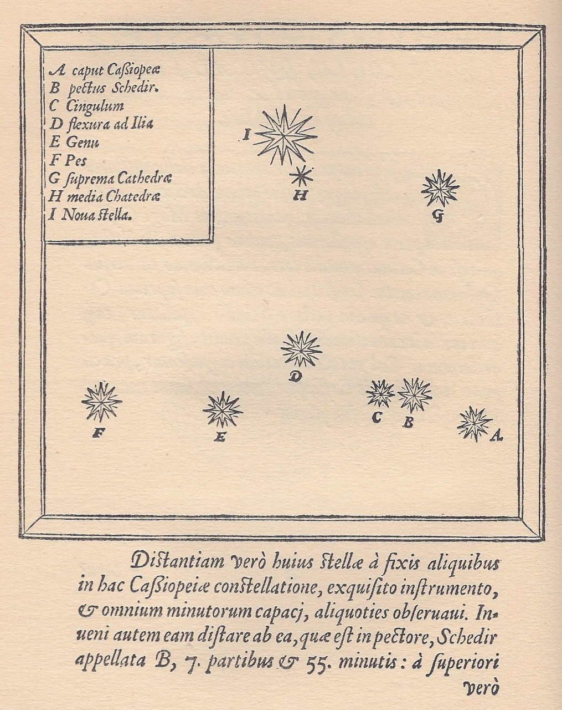

# Stella Nova

Skin para MediaWiki, especialmente diseñado y desarrollado para la wiki
de la e[ad] PUCV desde cero (con `SkinMustache` + `skin.json`).

Este skin está deliberadamente dedicado a
**[Casiopea](https://wiki.ead.pucv.cl)** pero es fácilmente extendible
a cualquier wiki con poco esfuerzo.

Está pensado desde la pantalla pequeña del teléfono en mente, con CSS
moderno (que usa Grid/Flexbox, parámetros centralizados y variación de
tema claro/oscuro), y con foco en accesibilidad WCAG 2.1 AA y con
compatibilidad con Semantic MediaWiki.



### Del nombre

El 11 de noviembre de 1572, el astrónomo danés **Tycho Brahe** observó
una estrella nueva y brillante en la constelación de **Casiopea**. La
llamó *stella nova* y documentó sus mediciones en
*[De nova stella](https://library-harvard-edu.translate.goog/exhibits/tycho-brahes-new-star?_x_tr_sl=en&_x_tr_tl=es&_x_tr_hl=es&_x_tr_pto=tc)*
(1573), el tratado que dio al mundo la palabra «nova».

Aquello no era una estrella naciendo sino muriendo: hoy se conoce como
**[SN 1572](https://en.wikipedia.org/wiki/SN_1572)**, «la supernova de
Tycho», una supernova de tipo Ia en el brazo de Perseo, a unos
8.000–13.000 años luz. Llegó a brillar como Venus (magnitud ≈ −4), fue
visible a plena luz del día durante semanas y se apagó en marzo de
1574. Su mayor consecuencia no fue astronómica sino filosófica:
demostró que los cielos —que la tradición aristotélica creía inmutables
y perfectos— **cambian**. Fue una de las grietas por donde entró la
revolución científica.

## Instalación

```php
wfLoadSkin( 'StellaNova' );
// opcional durante desarrollo:
// $wgDefaultSkin = 'stellanova';
```

Probar sin cambiar el default: añadir `?useskin=stellanova` a cualquier
URL.

**Nombre de carpeta:** `wfLoadSkin( 'X' )` carga `skins/X/skin.json`, así
que el argumento debe coincidir con la carpeta. Las **URLs de los assets
(fuentes incluidas) se calculan de la carpeta real** donde el wiki sirve el
skin (`Hooks::onResourceLoaderRegisterModules`), no de un nombre fijo: por
eso da igual clonar en `StellaNova`, `stella-nova` o vía symlink — basta que
el `wfLoadSkin` apunte a esa carpeta y los woff2 resuelven solos. (Antes,
`remoteSkinPath` estaba hardcodeado y las fuentes daban 404 si la carpeta no
se llamaba exactamente `StellaNova`.)

## Logo / isotipo

El skin muestra **dos** assets de marca en la cabecera:

| Asset | Config | Bundle por defecto | Uso |
|---|---|---|---|
| **Wordmark** (logotipo + constelación) | `$wgStellaNovaIsotypePath` | `resources/casiopea.svg` | Cabecera en viewport normal |
| **Glifo compacto** (cuadrado, sin texto) | `$wgStellaNovaIconPath` | `resources/casiopea-icon.svg` | Viewport estrecho + barra de pantalla completa |

A diferencia del `` de `$wgLogos` (que es opaco al CSS y no se puede
recolorear), el skin **lee el SVG del disco y lo incrusta *inline*** en el
HTML. Eso permite tematizarlo claro/oscuro automáticamente sin mantener dos
archivos. Por eso el logo se configura con una **ruta de sistema de archivos**
(no una URL) y **debe ser un SVG** (un bitmap no se puede incrustar así).

### Usar tu propio logo

En `LocalSettings.php`, después de `wfLoadSkin( 'StellaNova' )`:

```php
$wgStellaNovaIsotypePath = '/ruta/absoluta/en/el/servidor/mi-logo.svg';
$wgStellaNovaIconPath    = '/ruta/absoluta/en/el/servidor/mi-icono.svg';
```

Si no se definen (o el archivo no es legible), el skin usa el bundle de
Casiopea, así que el repo funciona out-of-the-box.

**Dónde colocar el archivo.** *No* dentro de la carpeta del skin: se pierde en
cada `git pull` / actualización. Ponlo en una ubicación estable servida por el
mismo host y a prueba de upgrades — la convención MediaWiki es bajo
`$IP/images/` (p. ej. `images/branding/mi-logo.svg`). Con `$IP` = raíz de tu
instalación (`.../w`), la config quedaría
`$wgStellaNovaIsotypePath = "$IP/images/branding/mi-logo.svg";`.

### Cómo construir un buen SVG claro-oscuro

El truco es **no fijar colores**: el skin pinta el logo con la *tinta* del tema
activo vía la propiedad CSS `color`, que el SVG hereda con `currentColor`. Un
SVG que cumpla este contrato se ve oscuro sobre papel en modo claro y claro
sobre tinta en modo oscuro, sin variantes ni `@media`.

Reglas:

1. **Todo el color es `currentColor`.** Usa `fill="currentColor"` en el `<svg>`
   raíz y `stroke="currentColor"` en los trazos. **No** uses `#000`, `#fff`,
   `black`, `white` ni colores absolutos en ningún elemento — quedarían fijos y
   romperían un tema.
2. **Fondo transparente.** Sin `<rect>` de fondo. El papel del skin es el fondo.
3. **Monocromo.** El sistema es de una sola tinta. Si necesitas jerarquía
   (p. ej. líneas más tenues que las estrellas), gradúala con **`opacity`**, no
   con otro color. Puedes incluir un `<style>` interno con clases para eso:
   ```xml
   <style>
     .linea  { stroke: currentColor; fill: none; opacity: .45; }
     .estrella { fill: currentColor; }
   </style>
   ```
4. **Accesible e inerte.** Añade `aria-hidden="true"` y `focusable="false"` al
   `<svg>` (el texto accesible lo aporta el enlace a portada, no el SVG).
5. **Autocontenido.** Sin referencias externas (`<image href>`, fuentes por URL,
   `<use href="otro.svg#…">`). Convierte el texto a trazados (`<path>`) para no
   depender de fuentes del sistema. El skin elimina el prólogo `<?xml?>` y los
   comentarios al incrustar; lo demás se inyecta tal cual.

### Dimensiones recomendadas

No hay tamaño en píxeles: el SVG escala. Lo que importa es el **`viewBox`** (su
proporción) porque el CSS fija la **altura** y el ancho se deduce de ahí.

- **Wordmark** — horizontal, proporción ≈ **4:1 a 5:1** (el bundle es
  `viewBox="0 0 524 115"`, ~4.6:1). El skin lo escala a la altura de la barra
  (~2rem / 32px); a esa altura el texto debe seguir legible, así que evita
  trazos demasiado finos (grosor de trazo ≥ ~2 unidades en el viewBox).
- **Glifo compacto** — **cuadrado 1:1** (el bundle es `viewBox="0 0 148 148"`).
  Se muestra a ~2rem; debe leerse bien como marca diminuta, sin el wordmark.
- Deja un pequeño **margen interno** dentro del `viewBox` (que los trazos no
  toquen el borde) para que no se recorte al alinearse en la barra.

## Chrome administrable y seguridad del namespace

Tres slots del chrome se editan **como páginas de la wiki**, no en código: el
**aviso** de cabecera (`Stella-Nova:Aviso`), el **pie** institucional
(`Stella-Nova:Pie`) y —opcional, si se usa— la **barra lateral**
(`Stella-Nova:Barra lateral`). El skin lee cada página, y si tiene contenido lo
inyecta en su slot; si está **vacía o no existe**, el slot no se muestra
(`SkinStellaNova::resolveFragment`).

Como el aviso aparece en **todas las páginas**, su fuente es un objetivo de
vandalismo con alcance sitio-completo. Por eso estas páginas **deben vivir en un
namespace dedicado con la escritura restringida**. El skin ya lo prefiere; falta
declararlo en la instalación.

### Los dos modos (y por qué importa)

- **Con namespace dedicado (correcto):** si el namespace `Stella-Nova` está
  declarado, los fragmentos viven ahí y **toda** escritura —crear, editar,
  borrar, mover— exige un derecho. Un vándalo no puede ni crear la página.
- **Sin él (fallback inseguro):** si no se declara, el skin cae a una página del
  espacio principal cuyo título literal es `Stella-Nova:Aviso` (con dos puntos),
  **sin ninguna restricción de escritura**. Es solo conveniencia, no seguridad.

### Configuración (LocalSettings.php)

```php
define( 'NS_STELLANOVA', 3000 );          // verifica que 3000/3001 estén libres
define( 'NS_STELLANOVA_TALK', 3001 );      // (Especial:Versión → Espacios de nombres)
$wgExtraNamespaces[NS_STELLANOVA]      = 'Stella-Nova';
$wgExtraNamespaces[NS_STELLANOVA_TALK] = 'Stella-Nova_discusión';
$wgNamespaceProtection[NS_STELLANOVA]  = [ 'editinterface' ];
$wgContentNamespaces[]                 = NS_STELLANOVA;   // opcional: cuenta como contenido
```

- El nombre del namespace **debe ser exactamente `Stella-Nova`** (con guion): es
  el que el skin busca con `getNsIndex`.
- **Derecho de escritura.** `editinterface` lo tienen sysops e interface-admins
  — suele ser lo que quieres. Para **delegar** la edición del aviso a un grupo
  propio sin darles todo el poder de sysop, define un grupo y un derecho:
  ```php
  $wgGroupPermissions['editores-de-interfaz']['editinterface'] = true;
  // luego asigna el grupo en Especial:PermisosDeUsuario
  ```
  (Las cuentas temporales de MW 1.43 no tienen el grupo ni sysop → denegadas,
  que es lo correcto.)

### Migración de páginas ya existentes (evitar huérfanas)

Declarar el namespace **cambia cómo resuelve** el título `Stella-Nova:Aviso`:
pasa a ser *namespace + "Aviso"* en vez de una página del espacio principal. Si
ya tienes esas páginas en el espacio principal, sigue este orden para **no dejar
copias huérfanas** inaccesibles:

1. **Copia el wikitexto** actual de `Stella-Nova:Aviso` y `Stella-Nova:Pie`
   (`?action=raw` o Editar → copiar).
2. **Borra** esas páginas del espacio principal **mientras el namespace aún no
   está declarado** (así sus títulos todavía apuntan a ellas y son borrables).
3. **Declara** el namespace (bloque de arriba) y ejecuta `php maintenance/
   update.php` si tu instalación lo pide.
4. **Recrea** el contenido dentro del namespace ya protegido — como sysop, o por
   CLI: `php maintenance/edit.php --user "TuAdmin" "Stella-Nova:Aviso" < aviso.txt`.

Si te saltaste el paso 2 y quedaron huérfanas en el espacio principal (siguen
existiendo pero su título ya no las alcanza), bórralas **por pageid** — un
`Special:Export`/consulta te da el id — con un script de mantenimiento
(`WikiPageFactory::newFromID($id)` → `DeletePageFactory`).

### Regla operativa: para quitar un aviso, VACÍA — no borres

El skin trata **contenido en blanco = sin aviso** (oculta el slot). Por lo tanto
**nunca borres la página para retirar un aviso: vacíala**. Borrar y recrear hace
que la página nazca y muera, y con cada recreación la protección por-página se
perdería; mantenerla siempre existente (aunque vacía) conserva la protección del
namespace y elimina el ciclo crear/borrar que abría el hueco. Publicar un aviso =
escribir su texto; retirarlo = dejar la página en blanco.

## Fundamentos y enfoque

Stella Nova sigue el camino oficial de MediaWiki para skins modernos:
**`SkinMustache` + `skin.json`**, separando datos (PHP) de presentación
(Mustache + CSS) y declarando todo en JSON.

- **[`skin.json`](skin.json)** declara el grueso: el nombre del skin, los
  `ResourceModuleSkinStyles` (estilos para extensiones), los `Hooks`, los
  `MessagesDirs`. **No hay archivo de bootstrap PHP** que llame a
  `wfLoadSkin`. La única salvedad: los `ResourceModules` del skin
  (`skins.stellanova.styles` / `.scripts`) se registran en PHP
  (`Hooks::onResourceLoaderRegisterModules`) en vez de declararse aquí, para
  calcular su `remoteSkinPath` de la carpeta real y que las fuentes resuelvan
  sin importar cómo se llame el directorio al clonar (ver *Instalación*).
- **[`includes/SkinStellaNova.php`](includes/SkinStellaNova.php)**
  extiende `SkinMustache`. Es la **única** clase PHP del skin (aparte
  de los hooks): el resto del trabajo lo hace la plantilla. Su única
  responsabilidad es emitir las *data keys* propias que el `.mustache`
  va a interpolar (`is-sn-fullscreen`, `sn-identity`, `sn-isotype`,
  `sn-prefs`, `sn-chrome.notice/sidebar/footer`).
- **[`includes/templates/skin.mustache`](includes/templates/skin.mustache)**
  es la plantilla raíz. Consume las data keys que emite `SkinMustache`
  (`{{{html-headelement}}}`, `{{{html-body-content}}}`,
  `{{#data-portlets}}`…) más las propias del skin. Empieza con
  `{{{html-headelement}}}` y cierra con `</body></html>`.
- **[`includes/Hooks.php`](includes/Hooks.php)** registra el behaviour
  switch `__PANTALLACOMPLETA__`, sirve las preferencias del usuario
  como opciones de cuenta cuando está registrado, e inyecta el script
  inline de pre-pintado (resuelve tema y preferencias **antes** del
  primer paint para evitar FOUC).
- **[`resources/tokens.css`](resources/tokens.css)** define el sistema
  de diseño con *custom properties* (`--sn-*`): paleta, escala
  tipográfica, ritmo vertical (*baseline grid*), espacios, sombras,
  movimiento. Light/dark se voltea solo cambiando un puñado de tokens.
- **[`resources/stella-nova.css`](resources/stella-nova.css)** consume
  los tokens para el layout y los componentes. Sin Bootstrap, sin
  framework — CSS moderno (Grid, Flexbox, container queries puntuales,
  `:has()`, `color-mix()`).
- **[`resources/skin.js`](resources/skin.js)** es JS vanilla (sin
  jQuery propio) y de mejora progresiva: sin él la página es legible y
  el pre-pintado de `Hooks.php` ya aplicó el tema. Cubre el panel de
  preferencias, los menús emergentes y la búsqueda como modal en
  viewport compact.

Si vienes a tocar el skin por primera vez, conviene leerlo en este
orden: `skin.json` (qué declara) → `skin.mustache` (qué emite) →
`tokens.css` (qué variables hay) → `stella-nova.css` (cómo se aplica).
`SkinStellaNova.php` solo si necesitas un dato nuevo en la plantilla.

## Documentación

- **[`docs/ARCHITECTURE.md`](docs/ARCHITECTURE.md)** — principios y
  doctrina: SkinMustache, `skinStyles` para SMW/SRF, mobile-first,
  WCAG 2.1 AA, identidad tri-estado, chrome administrable.
- **[`docs/DEVELOPMENT.md`](docs/DEVELOPMENT.md)** — plan de
  desarrollo: estado, roadmap M0–M8, workflow local, checklist de
  verificación, decisiones tomadas (y por qué).
- **[`docs/LAYOUTS.md`](docs/LAYOUTS.md)** — esquemas ASCII de los
  layouts del skin: estándar (desktop), compact (mobile),
  `__PANTALLACOMPLETA__` (`.sn-canvas`), drawer de preferencias e
  impresión. Con breakpoints anotados.
- **[`docs/DISENO.md`](docs/DISENO.md)** — para diseñadoras y
  diseñadores: dónde tocar cada cosa (tabla), cómo iterar sin pelear
  con la caché de ResourceLoader, tipografía/íconos/color, y el
  espécimen gráfico ([en línea](https://hspencer.github.io/stella-nova/specimen/)
  o local en [`docs/specimen/`](docs/specimen/)) para iterar el
  sistema visual sin levantar la wiki.
- **[`docs/EXTENSIONES.md`](docs/EXTENSIONES.md)** — compatibilidad
  con extensiones: cómo el skin **absorbe** los CSS de 22 extensiones
  (incl. SMW, SRF, PageForms, OOUI, Maps, Echo…) sin parchearlas, los
  dos niveles de absorción (reescrita a mano vs snapshot tokenizado)
  y el flujo para integrar una nueva.
- **[`docs/WIKITEXTO.md`](docs/WIKITEXTO.md)** — guía editorial para
  quien escribe páginas: palabras mágicas del skin
  (`__PANTALLACOMPLETA__`) y clases CSS opt-in disponibles desde
  wikitexto (`full-width`, `fondo-*`, `grilla` + `cols-N`, `plantilla`,
  `img-circle`, `wiki-btn`, `fw-*`, `noprint`, `sn-notice`).
- **[`specs/stella-nova.allium`](specs/stella-nova.allium)** —
  especificación de comportamiento (Allium): resolución de
  preferencias, chrome administrable desde el namespace `Stella-Nova`,
  modo pantalla completa, identidad tri-estado (anónimo / cuenta
  temporal 1.43 / registrado) y el contrato de fidelidad estructural
  con MediaWiki y sus extensiones.

## Licencia

**Artistic License 2.0** (`Artistic-2.0`). Ver [`COPYING`](COPYING), que
incluye el aviso en castellano y el texto original vinculante en inglés.

Copyright © 2026 Herbert Spencer González · .:TIG:. Taller de
Investigaciones Gráficas de la e[ad] Escuela de Arquitectura y Diseño de la
Pontificia Universidad Católica de Valparaíso · Corporación Cultural
Amereida.

Dos archivos de `resources/skinStyles/` (`mermaid.css`, `pagenotice.css`)
incorporan CSS de extensiones de MediaWiki y conservan su licencia original
GPL-2.0-or-later; el resto del skin es Artistic-2.0.

### Advertencia

Este proyecto está vivo, por lo que es cambiante e inestable,
seguramente con fallas y aspectos incompletos. Tiene los bordes
filosos, cuidado con cortarse los dedos.
